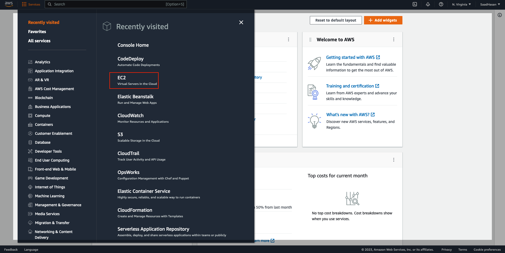
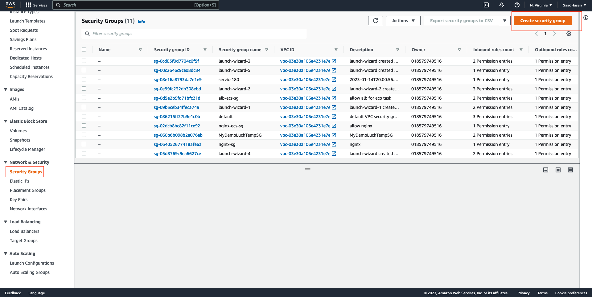
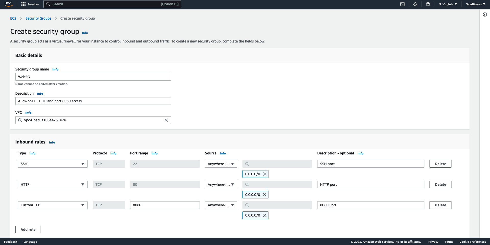
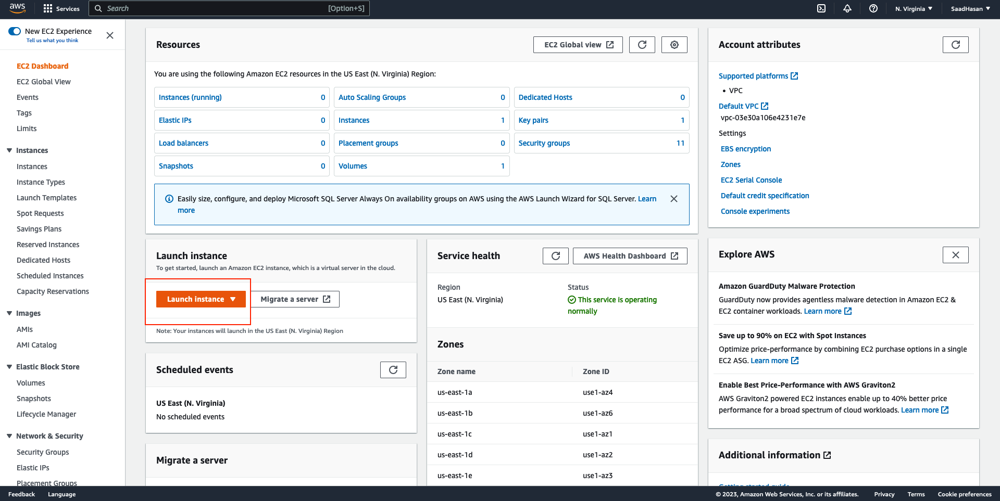
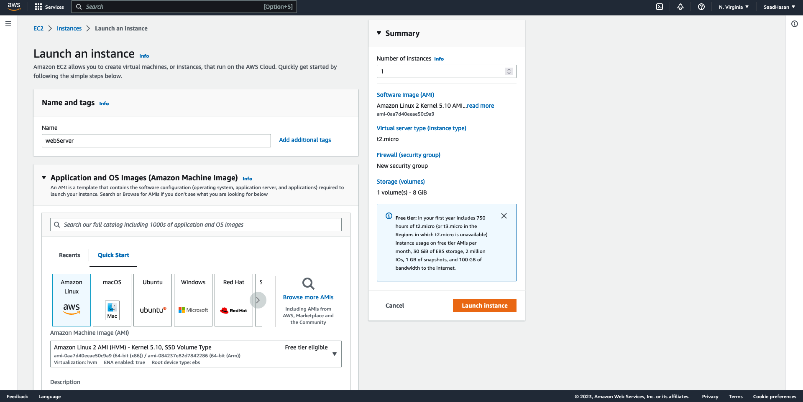
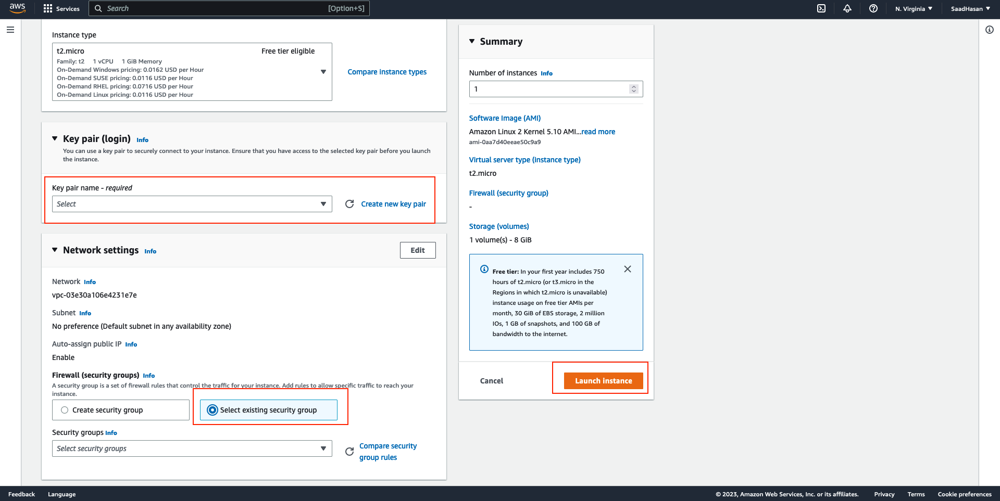
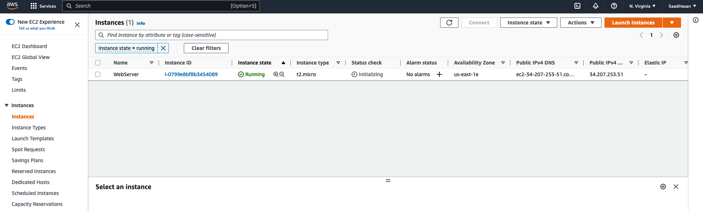
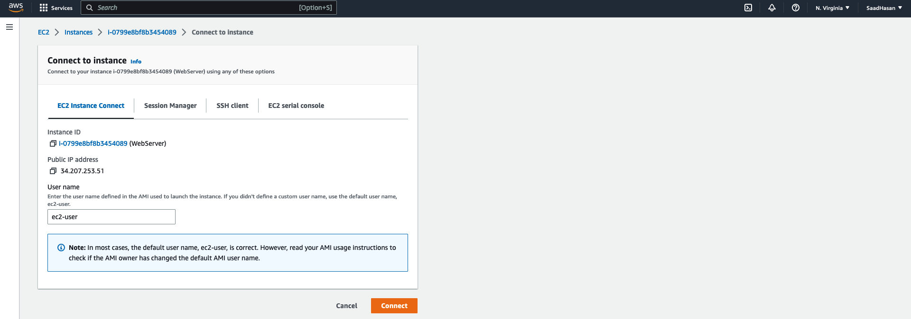
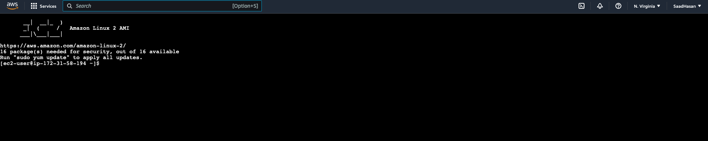

# setup-jenkins-with-awsEC2

Jenkins on AWS

Jenkins is an open-source automation server that integrates with a number of AWS Services, including: AWS CodeCommit, AWS CodeDeploy, Amazon EC2 Spot, and Amazon EC2 Fleet. You can use Amazon Elastic Compute Cloud (Amazon EC2) to deploy a Jenkins application on AWS.

In this tutorial , you will go through the process of setup Jenkins in EC2 instance. Firstly , you will lunch EC2 instance and confgire the security group inboud trafic to allow SSH and the port for Jenkins , then you will SSH into EC2 instance and install Jenkins. 

Steps to follow : 

1. Prerequisites
2. Create a key pair using Amazon EC2 - skip this if you have already done this before. 
3. Create the security group rules - skip this if you have aleardy done this. 
4. Lunch EC2 instance. 
5. SSH into EC2 and install and configure Jenkins. 
6. Clean up. 

Step 1 : Prerequisites

a. You must have AWS account
b. An amazon EC2 key pair. 
c. AWS IAM User with programmatic key access and permisition to lunch EC2 instances. 

Step 2 : Creating a key pair 
A key pair is a combination of a public key that is used to encrypt data and a private key that is used to decrypt data. 

To create your key pair: 

1. Open the Amazon EC2 console at https://console.aws.amazon.com/ec2/ and sign in.
2. In the navigation pane, under NETWORK & SECURITY, select Key Pairs.
3. Select Create key pair.
4. For Name, enter a descriptive name for the key pair.
5. For File format, select the format in which to save the private key.
     - For OpenSSH compatibility, select pem.
     - For PuTTY compatibility, select ppk.
6. Select Create key paira and then the private key file downloads automatically.
7. If you want to access the instance using SSH in macOS or lINUX enviroment , please run below command to set the permisition for the private
key .pem file 

  $ chmod 400 <Key_pair_name>.pem 

Step 3: Creating a security group 

A security group acts as a firewall that controls the traffic allowed to reach one or more EC2 instances. 
When you launch an instance, you can assign it one or more security groups.You add rules that control the traffic 
allowed to reach the instances in each security group. You can modify a security group’s rules any time, and the new rules
take effect immediately.

The ports need to be opend for this tutorial are: 
  1. 443 for SSH /HTTPS to allow inbound traffic from your static IP or from anyware.
  2. 80 to allow inbound traffic from anyware.

1. if you want to allow only access from your PC IP , you can check your IP from this link :http://checkip.amazonaws.com/ 
    otherwise , use the IP address range 0.0.0.0/0 . 

2. Sign in to the AWS Management Console.
3. Open the Amazon EC2 console by selecting EC2 under Compute.

4. In the left-hand navigation bar, select Security Groups, and then select Create Security Group.

5. In Security group name, enter WebSG or any preferred name of your choice, and provide a description.
6. Select your VPC from the list. You can use the default VPC.
7. On the Inbound tab, add the rules as below : 

Step 4 : Launching an Amazon EC2 instance

After your are done with SG and key piar configuration , you can now lunch EC2 instance. 
To do so , follow the steps below : 

1. Sign in to the the AWS Management Console.
2. Open the Amazon EC2 console by selecting EC2 under Compute.
3. From the Amazon EC2 dashboard, select Launch Instance.

4. Then choose the Amazon Machine Image (AMI) based on your requirments , in this tutorial , we will use Amazon Linux AMI to stay on the free tier with type t2.micro.

5. Scroll down and select the key pair you created in the creating a key pair section above or any existing key pair you intend to use.

  a. Select Select an existing security group.
  b. Select the WebSG security group that you created.
  c. Select Launch Instance.

6. In the left-hand navigation bar, choose Instances to view the status of your instance. Initially, the status of your instance is pending. After the status changes to running, your instance is ready for use.

Step 5 : Installing and configuring Jenkins

After lunching the EC2 instance , Jenkins can be installed properly.

In this step you will deploy Jenkins on your EC2 instance by completing the following tasks:

  a. Connecting to your Linux instance 
  b. Downloading and installing Jenkins
  c. Configuring Jenkins

Step a : Connecting to your Linux instance

There are four ways to connect to your EC2 ( EC2 Instance Connect , Session Manager , SSH Client and EC2 serial console ). 
In this tutorial we will use EC2 Instance Connect : 

After connect : 

Note: If you want to connect using SSH , use the terminal if you are on MacOS , or PuTTY if you are on Windows. 

Step b: Downloading and installing Jenkins

Completing the previous steps enables you to download and install Jenkins on AWS. To download and install Jenkins:

Ensure that your software packages are up to date on your instance by uing the following command to perform a quick software update:

[ec2-user ~]$ sudo yum update –y
Add the Jenkins repo using the following command:

[ec2-user ~]$ sudo wget -O /etc/yum.repos.d/jenkins.repo \
    https://pkg.jenkins.io/redhat-stable/jenkins.repo
Import a key file from Jenkins-CI to enable installation from the package:

[ec2-user ~]$ sudo rpm --import https://pkg.jenkins.io/redhat-stable/jenkins.io.key
[ec2-user ~]$ sudo yum upgrade
Install Java:

[ec2-user ~]$ sudo amazon-linux-extras install java-openjdk11 -y
Install Jenkins:

[ec2-user ~]$ sudo yum install jenkins -y
Enable the Jenkins service to start at boot:

[ec2-user ~]$ sudo systemctl enable jenkins
Start Jenkins as a service:

[ec2-user ~]$ sudo systemctl start jenkins
You can check the status of the Jenkins service using the command:

[ec2-user ~]$ sudo systemctl status jenkins

